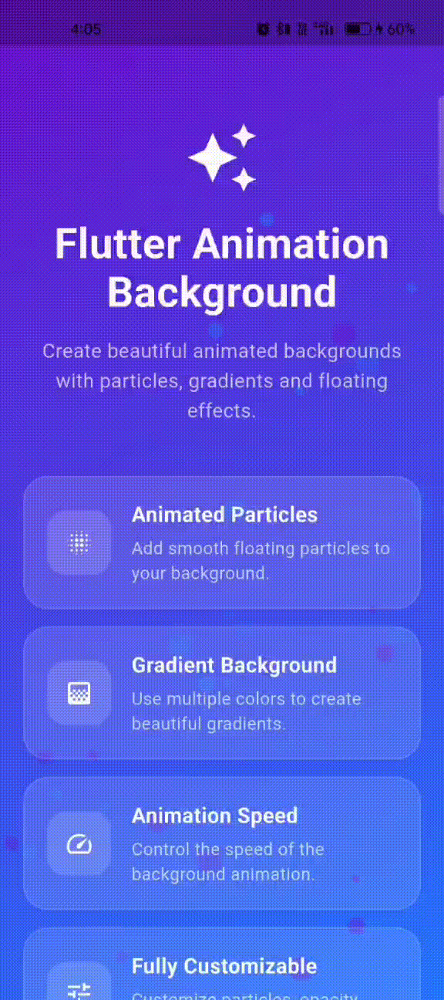

# Flutter Animation Background

A beautiful and customizable Flutter package for creating animated backgrounds with gradient colors, floating particles, customizable particle sizes, opacity, animation speed, and more.

Perfect for splash screens, login screens, onboarding screens, home screens, dashboards, landing pages, and modern Flutter applications.

## Demo

<p align="center">
  
</p>

## Features

* 🎨 Customizable gradient background
* ✨ Animated floating particles
* 🌈 Multiple gradient colors
* ⚡ Custom animation speed
* 🔵 Custom particle count
* 📏 Custom particle size
* 👻 Custom particle opacity
* 🎯 Custom gradient alignment
* 🔘 Enable or disable particles
* 🔘 Enable or disable gradient
* 🌊 Enable or disable floating animation
* 📱 Supports any child widget
* 🧩 Simple and reusable API
* 🚀 Lightweight and easy to integrate
* 💙 Built with Flutter

## Installation

Add the package to your `pubspec.yaml`:

```yaml
dependencies:
  flutter_animation_background: ^1.0.0
```

Then run:

```bash
flutter pub get
```

Or install it using:

```bash
flutter pub add flutter_animation_background
```

## Import

```dart
import 'package:flutter_animation_background/flutter_animation_background.dart';
```

## Basic Usage

```dart
import 'package:flutter/material.dart';
import 'package:flutter_animation_background/flutter_animation_background.dart';

class MyHomePage extends StatelessWidget {
  const MyHomePage({super.key});

  @override
  Widget build(BuildContext context) {
    return Scaffold(
      body: AnimationBackground(
        child: Center(
          child: Text(
            'Welcome',
            style: TextStyle(
              color: Colors.white,
              fontSize: 30,
              fontWeight: FontWeight.bold,
            ),
          ),
        ),
      ),
    );
  }
}
```

## Custom Configuration

Use `AnimationBackgroundConfig` to customize the background and particle animation.

```dart
AnimationBackground(
  config: const AnimationBackgroundConfig(
    colors: [
      Color(0xFF6A11CB),
      Color(0xFF2575FC),
    ],
    particleCount: 40,
    particleMinSize: 3,
    particleMaxSize: 10,
    animationSpeed: 2.0,
    particleOpacity: 0.5,
    enableParticles: true,
    enableGradient: true,
    enableFloating: true,
    begin: Alignment.topLeft,
    end: Alignment.bottomRight,
  ),
  child: const Center(
    child: Text(
      'Flutter Animation',
      style: TextStyle(
        color: Colors.white,
        fontSize: 28,
        fontWeight: FontWeight.bold,
      ),
    ),
  ),
)
```

## Configuration

| Property          | Type          |       Default | Description                          |
| ----------------- | ------------- | ------------: | ------------------------------------ |
| `colors`          | `List<Color>` | Purple / Blue | Gradient colors                      |
| `particleCount`   | `int`         |          `30` | Number of particles                  |
| `particleMinSize` | `double`      |         `3.0` | Minimum particle size                |
| `particleMaxSize` | `double`      |        `10.0` | Maximum particle size                |
| `animationSpeed`  | `double`      |         `2.0` | Animation speed                      |
| `particleOpacity` | `double`      |         `0.5` | Particle transparency                |
| `enableParticles` | `bool`        |        `true` | Enable or disable particles          |
| `enableGradient`  | `bool`        |        `true` | Enable or disable gradient           |
| `enableFloating`  | `bool`        |        `true` | Enable or disable floating animation |
| `begin`           | `Alignment`   |     `topLeft` | Gradient starting position           |
| `end`             | `Alignment`   | `bottomRight` | Gradient ending position             |

## Custom Gradient Colors

You can provide your own gradient colors.

```dart
AnimationBackground(
  config: const AnimationBackgroundConfig(
    colors: [
      Color(0xFF141E30),
      Color(0xFF243B55),
    ],
  ),
  child: YourWidget(),
)
```

## Custom Particle Count

Control the number of particles:

```dart
AnimationBackground(
  config: const AnimationBackgroundConfig(
    particleCount: 60,
  ),
  child: YourWidget(),
)
```

## Custom Particle Size

Control the minimum and maximum particle size:

```dart
AnimationBackground(
  config: const AnimationBackgroundConfig(
    particleMinSize: 2,
    particleMaxSize: 8,
  ),
  child: YourWidget(),
)
```

## Custom Animation Speed

Control how fast the background animation runs:

```dart
AnimationBackground(
  config: const AnimationBackgroundConfig(
    animationSpeed: 2.0,
  ),
  child: YourWidget(),
)
```

Higher values make the animation faster.

Examples:

```dart
animationSpeed: 1.0,
```

Normal animation speed.

```dart
animationSpeed: 2.0,
```

Faster animation.

```dart
animationSpeed: 3.0,
```

Very fast animation.

## Particle Opacity

Control particle transparency using a value between `0.0` and `1.0`.

```dart
AnimationBackground(
  config: const AnimationBackgroundConfig(
    particleOpacity: 0.7,
  ),
  child: YourWidget(),
)
```

## Disable Particles

```dart
AnimationBackground(
  config: const AnimationBackgroundConfig(
    enableParticles: false,
  ),
  child: YourWidget(),
)
```

## Disable Gradient

```dart
AnimationBackground(
  config: const AnimationBackgroundConfig(
    enableGradient: false,
  ),
  child: YourWidget(),
)
```

## Disable Floating Animation

```dart
AnimationBackground(
  config: const AnimationBackgroundConfig(
    enableFloating: false,
  ),
  child: YourWidget(),
)
```

## Custom Gradient Direction

You can customize the direction of the gradient.

```dart
AnimationBackground(
  config: const AnimationBackgroundConfig(
    begin: Alignment.topCenter,
    end: Alignment.bottomCenter,
  ),
  child: YourWidget(),
)
```

## Login Screen Example

The package can be used behind a complete login screen.

```dart
import 'package:flutter/material.dart';
import 'package:flutter_animation_background/flutter_animation_background.dart';

class LoginScreen extends StatelessWidget {
  const LoginScreen({super.key});

  @override
  Widget build(BuildContext context) {
    return Scaffold(
      body: AnimationBackground(
        config: const AnimationBackgroundConfig(
          colors: [
            Color(0xFF141E30),
            Color(0xFF243B55),
          ],
          particleCount: 50,
          animationSpeed: 2.0,
          particleOpacity: 0.5,
        ),
        child: SafeArea(
          child: Padding(
            padding: const EdgeInsets.all(24),
            child: Column(
              mainAxisAlignment: MainAxisAlignment.center,
              children: [
                const Text(
                  'Welcome Back',
                  style: TextStyle(
                    color: Colors.white,
                    fontSize: 32,
                    fontWeight: FontWeight.bold,
                  ),
                ),
                const SizedBox(height: 30),
                TextField(
                  decoration: InputDecoration(
                    hintText: 'Email',
                    filled: true,
                    fillColor: Colors.white,
                    border: OutlineInputBorder(
                      borderRadius: BorderRadius.circular(12),
                    ),
                  ),
                ),
                const SizedBox(height: 16),
                TextField(
                  obscureText: true,
                  decoration: InputDecoration(
                    hintText: 'Password',
                    filled: true,
                    fillColor: Colors.white,
                    border: OutlineInputBorder(
                      borderRadius: BorderRadius.circular(12),
                    ),
                  ),
                ),
              ],
            ),
          ),
        ),
      ),
    );
  }
}
```

## Example Application

A complete example application is included in the `example` directory.

The example demonstrates:

* Animated gradient background
* Floating particles
* Custom particle count
* Custom particle size
* Animation speed
* Particle opacity
* Custom gradient colors
* Enable/disable animation options

Run the example:

```bash
cd example
flutter pub get
flutter run
```

## Testing

Run package tests:

```bash
flutter test
```

Run static analysis:

```bash
flutter analyze
```

Run example tests:

```bash
cd example
flutter test
```

Run example analysis:

```bash
flutter analyze
```

## Project Structure

```text
flutter_animation_background/
│
├── assets/
│
├── example/
│   ├── assets/
│   │   └── animation.gif
│   │
│   ├── lib/
│   │   └── main.dart
│   │
│   ├── test/
│   │   └── widget_test.dart
│   │
│   └── pubspec.yaml
│
├── lib/
│   ├── flutter_animation_background.dart
│   │
│   └── src/
│       ├── models/
│       │   └── animation_background_config.dart
│       │
│       ├── utils/
│       │   └── animation_utils.dart
│       │
│       └── widgets/
│           └── animation_background.dart
│
├── test/
│   └── flutter_animation_background_test.dart
│
├── README.md
└── pubspec.yaml
```

## API

### AnimationBackground

```dart
AnimationBackground({
  Key? key,
  required Widget child,
  AnimationBackgroundConfig config,
})
```

### AnimationBackgroundConfig

```dart
AnimationBackgroundConfig({
  List<Color> colors,
  int particleCount,
  double particleMinSize,
  double particleMaxSize,
  double animationSpeed,
  double particleOpacity,
  bool enableParticles,
  bool enableGradient,
  bool enableFloating,
  Alignment begin,
  Alignment end,
})
```

## Requirements

* Flutter
* Dart
* Material Design

Recommended environment:

```text
Flutter 3.41.9+
Dart 3.11.5+
```

## Performance

The package uses Flutter's animation system and `CustomPainter` to render animated particles.

For better performance on lower-end devices:

* Keep `particleCount` reasonable.
* Avoid unnecessarily large particle sizes.
* Avoid extremely high animation speeds.
* Disable effects that are not required.

Example:

```dart
AnimationBackground(
  config: const AnimationBackgroundConfig(
    particleCount: 30,
    animationSpeed: 2.0,
  ),
  child: YourWidget(),
)
```

## Demo GIF

The demo animation is stored at:

```text
example/assets/animation.gif
```

The GIF is displayed in this README using HTML:

```html
<p align="center">
  
</p>
```

## License

This project is licensed under the MIT License.

Copyright © 2026 Excelsior Technologies.

See the `LICENSE` file for more information.

## Author

**Sufiyan Shaikh**

Flutter Developer Intern at **Excelsior Technologies**

## GitHub

**Repository:**
https://github.com/sufiyanshaikh-1304/flutter_animation_background


